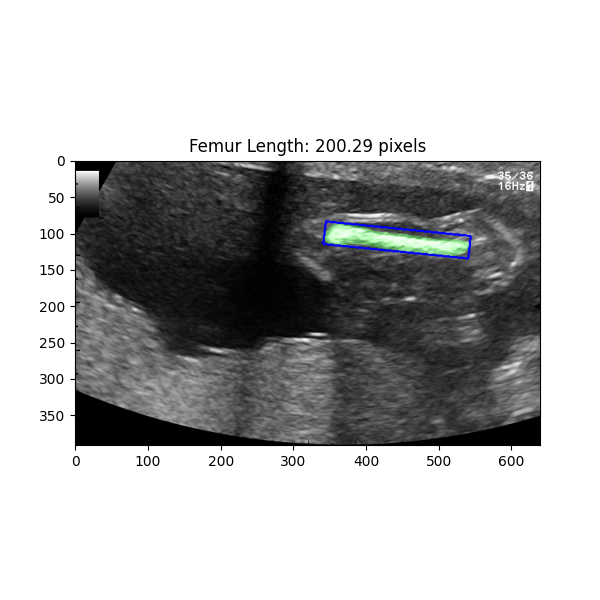
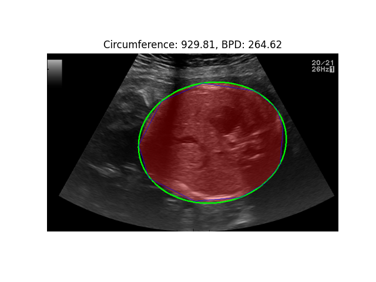

# 🧠 Automated Fetal Age & Weight Estimation using Deep Learning

This project implements a deep learning pipeline to automate fetal biometry from ultrasound images using segmentation and classical image processing. It estimates **gestational age (GA)** and **fetal weight** by analyzing key anatomical structures: **femur**, **abdomen**, and **brain**.

---

## 📌 Highlights

- 🔍 **UNet-based segmentation** with attention modules and ConvLSTM layers.
- 🧠 **Multi-organ detection** (femur, brain, abdomen) from 2D ultrasound images.
- 📐 **Biometric measurement extraction** using OpenCV (bounding boxes & ellipse fitting).
- 📊 **Gestational age & fetal weight estimation** based on medical formulas.
- ⏱️ **Reduces sonographer measurement time by up to 70%**.

---

## 🖼️ Sample Results

| Femur Segmentation | Abdomen Ellipse Fitting | Brain Segmentation |
|--------------------|-------------------------|--------------------|
|  |  |  |
